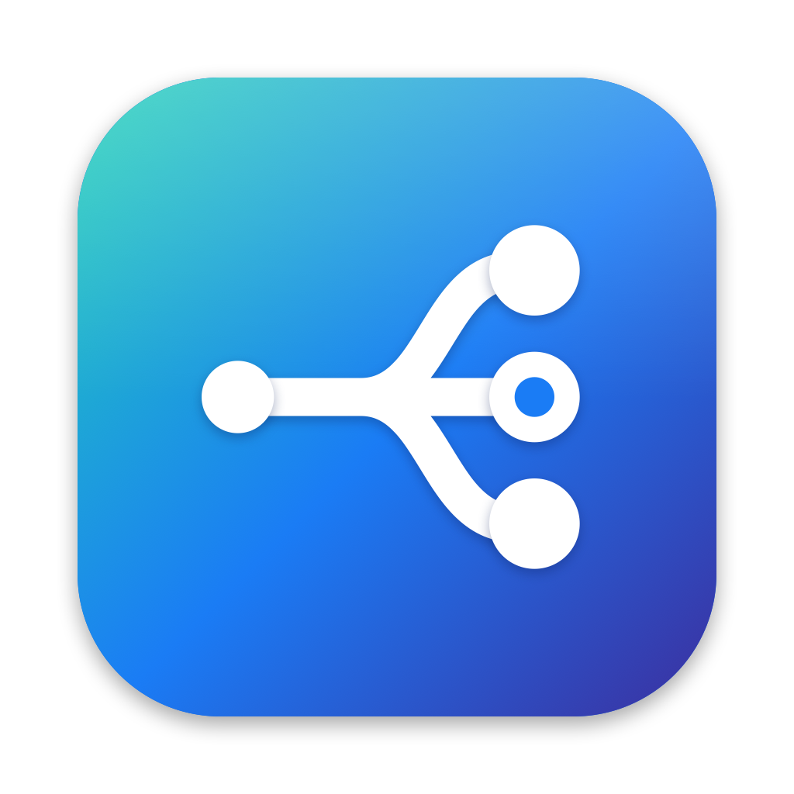
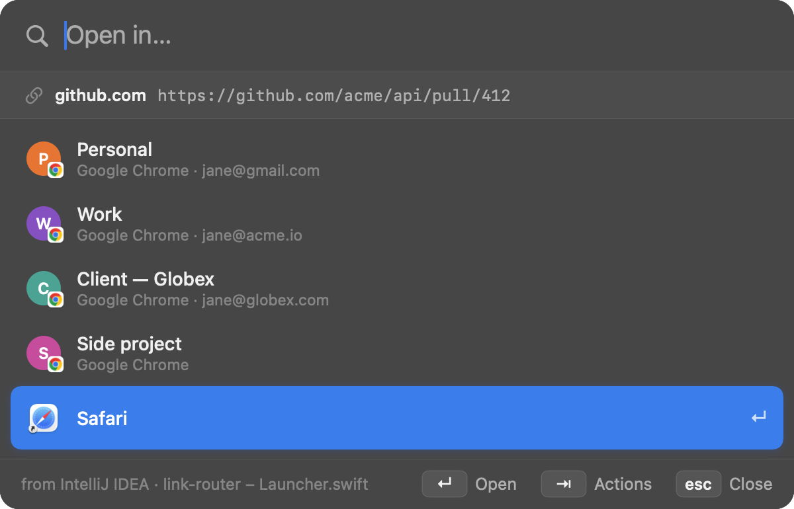
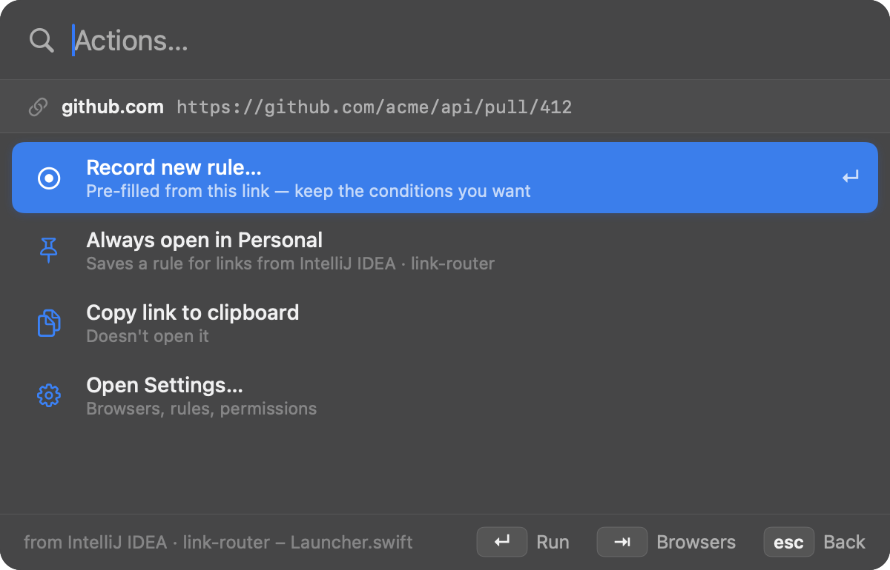
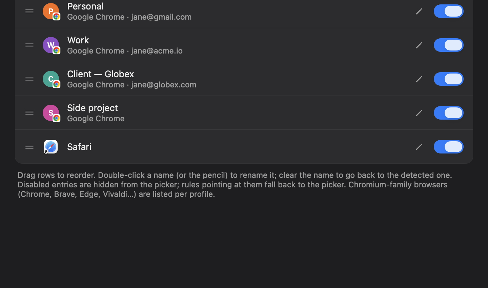
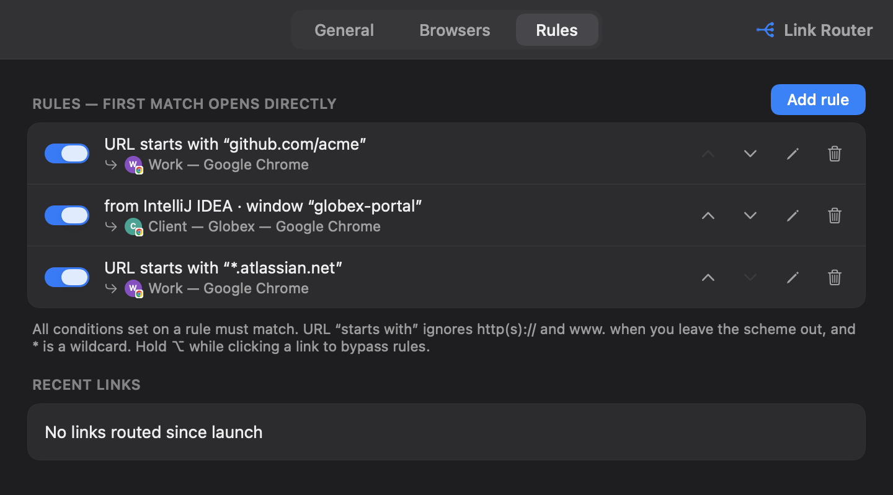

<div align="center">
  

  <h1>Link Router</h1>
  <p><b>A fast, keyboard-first default browser for macOS that sends every link to the right browser — or Chrome profile.</b></p>

  <p>
    
    
    
    
  </p>

  <p><a href="https://github.com/macrosak/link-router/releases/latest"><b>Download</b></a></p>
</div>

## What it is

Link Router sits in place of your default browser. When you click a link anywhere, it either
**opens it straight away** in the browser a rule picks, or shows a small **picker** — type a
few letters, hit `↵`, done. Every installed browser is listed, and Chromium-family browsers
(Chrome, Brave, Edge, Vivaldi, Chromium) are listed **per profile** — plus an **Incognito**
entry — so "work links in the work profile" is one keystroke or one rule.

- **Rules** on the URL (prefix with `*` wildcards, contains, or regex), the **source app**, and the
  **source window title** — e.g. each IntelliJ project window opens links in a different Chrome
  profile.
- **Fast.** The picker is up in ~20 ms. Handing a link to a running Chromium profile takes
  **~5 ms**: Link Router writes straight into the browser's own `SingletonSocket` instead of
  spawning a second browser process (which is what `open -na … --args --profile-directory` does,
  and why other pickers take a second or two).
- **Keyboard-first**, same look and feel as [Recallyx](https://github.com/macrosak/recallyx).
- Native Swift, no dependencies, MIT.

<p align="center">
  <br>
  <em>Click a link → type to filter → ↵.</em>
</p>

## Install

Requirements: **macOS 13 (Ventura) or newer** · **Apple Silicon (arm64)**.

**One command** (installs or updates to the latest release, then launches it):

```bash
curl -fsSL https://raw.githubusercontent.com/macrosak/link-router/main/install.sh | bash
```

Or grab the DMG from the [**Releases** page](https://github.com/macrosak/link-router/releases/latest),
drag **Link Router.app** onto **Applications**, and clear the quarantine flag once (the builds
are not notarized, so Gatekeeper otherwise blocks the first launch):

```bash
xattr -dr com.apple.quarantine "/Applications/Link Router.app"
```

On launch, Link Router checks whether it's your default browser and, if not, **offers to
register** (macOS then asks you to confirm). You can also do it any time from the menu-bar icon
or **Settings → General → Make default**.

## The picker

| Key | Does |
| --- | --- |
| *type* | Filter browsers / profiles (fuzzy: name, custom name, account email, app) |
| `↑` `↓` | Move the selection |
| `↵` | Open in the selected browser (the first match while filtering) |
| `⌘1`–`⌘9` | Open in the Nth browser — hold `⌘` to see the numbers |
| `⇥` | Switch to the **action menu** (and back) |
| `esc` | Clear the filter; then leave the action menu; then close |
| click | Open in the clicked browser |

**Actions (`⇥`)** work on the link and the browser that was highlighted when you pressed `⇥`.
They're filterable like the browser list:

- **Record new rule…** — the rule editor, pre-filled from this link (see [Rules](#rules)).
- **Always open in *&lt;browser&gt;*** — opens the link and saves a rule for this app + window
  project.
- **Copy link to clipboard** — without opening it.
- **Open Settings…**

<p align="center">
  <br>
  <em>⇥ — actions for the link.</em>
</p>

Hold **`⌥` while clicking a link** anywhere to skip the rules and get the picker.

## Browsers

**Settings → Browsers** lists every detected browser and profile in picker order:

- Each Chromium browser also gets an **Incognito** entry (opens the link in a private window).
- **Detect browsers** re-scans (new Chrome profiles are also picked up automatically after each
  link).
- **Drag** rows to reorder.
- **Toggle** to enable / disable — disabled entries are hidden from the picker.
- **Rename** with the pencil or a double-click — e.g. call a profile "tado" instead of "Work".
  The original name stays searchable; clear the field to go back to it.

<p align="center">
  
</p>

## Rules

Rules are checked top to bottom; the **first match opens directly**, no picker. Every
condition you set on a rule must match:

- **URL** — *starts with* (leave out the scheme and `https://`, `http://` and `www.` are
  ignored; `*` is a wildcard, e.g. `*.atlassian.net/browse`), *contains*, or *matches regex*.
- **Source app** — the app the link was clicked in.
- **Window title contains** — the source app's focused window, case-insensitive. IDEs put the
  project name in the title (`link-router – Launcher.swift`), so this is how you route per
  project. Needs **Accessibility** (see below).

Three ways to create one without typing patterns by hand:

- **`⇥` → Record new rule… in the picker — "a rule for links like this".** The editor opens
  pre-filled with the link's host, the source app and the project part of its window title,
  plus a live *matches this link* check. Clear what you don't need, pick the browser, **Save** —
  the rule is stored and the link opens with it. Cancel brings the picker back.
- **`⇥` → Always open in *&lt;browser&gt;*** — open and save a rule for the current app + window
  project in one go.
- **Settings → Rules → Recent links → Create rule…** — same pre-filled editor for any link
  routed since launch.

<p align="center">
  
</p>

## Permissions

Everything except window-title rules works with no permission. **Window-title rules need
Accessibility**: **Settings → General → Accessibility → Grant…** → toggle **Link Router** on
under **Privacy & Security → Accessibility** → **quit and relaunch** Link Router (macOS reads
the grant at process start).

Releases are signed with a stable (self-signed) *Link Router Release* identity, so the grant
survives updates — you grant it once. Builds you make yourself are signed differently (see
[Building from source](#building-from-source)), so switching between a self-built and a
released app needs a re-grant.

## Troubleshooting

- **"Accessibility" shows as not granted even though it's on** — macOS is holding a stale grant
  (e.g. after switching between a self-built and a released app, which are signed
  differently). Reset it and grant again:
  ```bash
  tccutil reset Accessibility io.github.macrosak.linkrouter
  killall LinkRouter; open "/Applications/Link Router.app"
  ```
- **Links still open in the old browser** — Link Router isn't the default: **Settings → General
  → Make default** and confirm the macOS dialog.
- **A browser is missing** — **Settings → Browsers → Detect browsers**. Only apps that open both
  `https` links and HTML files are listed; other link pickers (Burly, Velja, Choosy, Finicky…)
  are deliberately skipped so links can't bounce between them.
- **Blocked by Gatekeeper after replacing the app** — re-run the `xattr` command above (the
  install script does it for you).
- **Logs** — `log stream --predicate 'subsystem == "io.github.macrosak.linkrouter"'` shows every
  routed link, its source, the matching rule and how long the hand-off took.

Config lives in `~/Library/Application Support/Link Router/config.json`.

## Building from source

Only the **Command Line Tools** are needed (`xcode-select --install`) — no Xcode project.

```bash
# one-time, per machine: a stable code-signing identity, so the Accessibility grant
# survives rebuilds (ad-hoc signatures change on every build)
./scripts/create-signing-identity.sh        # prints one `security add-trusted-cert …` to run yourself

./scripts/bundle.sh && ./scripts/install.sh # build Link Router.app, install to ~/Applications, relaunch
./scripts/test.sh                           # unit tests
```

Releases are built by GitHub Actions on every push to `main` (`.github/workflows/release.yml`):
tests, `bundle.sh`, `make-dmg.sh`, then a GitHub release `0.<commit count>`.

## License

MIT — see [LICENSE](LICENSE).
